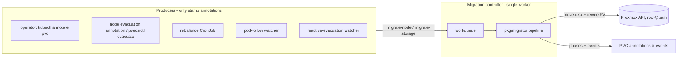

# Volume Migration Controller — Operator Guide

The migration controller automates what [`pvecsictl migrate`](pvecsictl.md) does manually: moving the backing Proxmox disk of a PersistentVolumeClaim to another Proxmox node (zone), then rewiring the PV's volume handle and topology so Kubernetes schedules against the new location. It is annotation-driven, strictly serialized, and built defensively around several Proxmox VE bugs and traps that were discovered — two of them by losing (disposable) test volumes — during live verification. This document covers how to use it, its limitations, the design decisions and the concrete failures that motivated them, and the Proxmox version caveats.

## Overview



Everything that *requests* a migration (operators, node evacuation, the rebalance CronJob, pod-follow) only stamps request annotations on PVCs. A single controller worker executes them **one at a time** through a shared pipeline (`pkg/migrator`) that is resumable after crashes and verifies every step before the irreversible one.

It is shipped as a subcommand of `pvecsictl` and deployed by the Helm chart:

```shell
pvecsictl controller --config=/etc/proxmox/config.yaml
```

## How to use

### Prerequisites

- **Proxmox credentials** in the migrator's cloud config, one of:
  - **`root@pam` username/password** (default). The built-in disk-copy endpoint has no permission check and is therefore root-only, so the migrator needs root. Keep these in a **dedicated secret**, separate from the CSI controller's token config, so the least-privileged component never holds root.
  - **A scoped API token** with `--token-copy-endpoint`. Install the [`pve-csi-copy`](../hack/pve-token-copy/) package on every Proxmox node and pass `--token-copy-endpoint` **to the controller** (it is a per-process flag; for a mixed fleet override it per cluster with `token_copy_endpoint: true` in the cloud-config, so clusters without the package keep the built-in path). The copy then runs through a permission-gated sibling endpoint (`Datastore.Audit` on the source + `Datastore.AllocateSpace` on the target), so no `root@pam` credential is needed. The token must also carry the privileges the rest of the migration uses: `VM.Audit` (read VM config during detach/helper lookup), `VM.Allocate` + `VM.Config.Disk` (the qcow2/vmdk helper-VM conversion), and `Datastore.Allocate` (partial-file and helper-disk cleanup). This is a real improvement over root@pam (no shell, ACL-path-scopeable) but still a **powerful** grant — `Datastore.Allocate` can delete any volume on that storage. Provide **only** the token (omit `username`/`password`): the client uses username/password when both are present, so leaving them in silently keeps you on root@pam. See [hack/pve-token-copy/README.md](../hack/pve-token-copy/README.md).
- Nodes labelled with `topology.kubernetes.io/region` / `zone` (or the `topology.proxmox.sinextra.dev/*` equivalents). Node-to-VMID resolution needs **no extra setup**: if the node has a `proxmox://<region>/<vmid>` providerID (Proxmox CCM) or the `proxmox.sinextra.dev/instance-id` annotation, that value is used; otherwise — e.g. a foreign providerID such as `rke2://…` on a cluster without the Proxmox CCM — the migrator resolves the VM from the Proxmox API the same way the CSI controller does: the VM whose name starts with the node name **and** whose SMBIOS UUID matches the node's system UUID, then by system UUID alone if no VM name matches. A VM found in a different region than the volume is rejected. The annotation remains an explicit override for setups the lookup cannot verify (e.g. nodes that report no system UUID).
- A **free Proxmox VM ID** for the transient conversion helper (`migrator.helperVMID`, default `9998`). It must not belong to a real VM and must differ from the controller VMID that owns the CSI disks.

### Deployment (Helm)

```yaml
# values.yaml
migrator:
  enabled: true
  config:
    clusters:
      - url: https://cluster-api-1.example.com:8006/api2/json
        insecure: false
        username: root@pam
        password: "strong-password"
        region: cluster-1
        # optional: preferred storage per node, used when the source storage
        # name does not exist on a pod-follow target node
        primary_storage:
          pve-3: local-zfs
```

```shell
helm upgrade -i --namespace=csi-proxmox -f values.yaml \
    proxmox-csi-plugin oci://ghcr.io/crunchymonkies/charts/proxmox-csi-plugin
```

This deploys:

- a `…-migrator` Deployment running `pvecsictl controller` with leader election (replicas > 1 are safe; one acts)
- a dedicated ServiceAccount, ClusterRole (pods delete, PV/PVC recreate, node cordon, events), and a namespaced Role for leases
- a `…-migrator` Secret holding the root-credential cloud config (or use `migrator.existingConfigSecret`)

### Migrating a single volume

```shell
kubectl -n default annotate pvc storage-test-0 csi.proxmox.sinextra.dev/migrate-node=hvm-2
```

Watch progress via the `migrate-phase` annotation and PVC events:

```shell
kubectl -n default get events --field-selector involvedObject.name=storage-test-0 -w
# MigrationStarted   migrating to proxmox node hvm-2
# MigrationMoving    moving disk 9999/vm-9999-pvc-… to proxmox node hvm-2 (as local:9999/vm-9999-pvc-….raw)
# MigrationCompleted migrated to proxmox node hvm-2
```

On success the PV's volume handle and node affinity point at the new zone, the request annotations are stripped (so it cannot re-trigger), and `migrate-phase: Completed` is set on the recreated PVC.

#### Request annotations (set these on a PVC)

| Annotation | Value | Meaning |
|---|---|---|
| `csi.proxmox.sinextra.dev/migrate-node` | Proxmox node name | Migrate this PVC's volume to the given zone |
| `csi.proxmox.sinextra.dev/migrate-force` | `"true"` | Allow disrupting pods that use the PVC (cordon + delete pods). Without it, an in-use PVC is skipped |
| `csi.proxmox.sinextra.dev/migrate-storage` | storage ID | Move the disk into this storage on the target node (default: keep the storage name). With `migrate-node` set to the volume's **current** node, this performs a same-node storage move (only the storage changes; same-node requests without a different storage are rejected as already-on-target) |

#### Status annotations (written by the controller)

| Annotation | Meaning |
|---|---|
| `csi.proxmox.sinextra.dev/migrate-phase` | `Pending`, `Draining`, `Moving`, `Rewiring`, `Completed`, `Skipped`, or `Failed` |
| `csi.proxmox.sinextra.dev/migrate-message` | Last error or progress message |
| `csi.proxmox.sinextra.dev/migrate-attempts` | Reconcile attempts so far |
| `csi.proxmox.sinextra.dev/migrate-started-at` | RFC3339 start time |

`Failed` is terminal: the controller will not retry until you change or remove the request annotations. Transient errors are retried with exponential backoff up to `--max-attempts` (default 5). `Skipped` means the migration was unnecessary (shared storage — see below).

### Node maintenance (evacuation)

Drain all CSI volumes off a Proxmox node before maintenance — either by annotating any Kubernetes node in that zone:

```shell
kubectl annotate node kube-store-11 csi.proxmox.sinextra.dev/evacuate=auto
```

| Annotation | Value | Meaning |
|---|---|---|
| `csi.proxmox.sinextra.dev/evacuate` | Proxmox node name or `auto` | Request migration of **all** CSI volumes out of this node's zone. `auto` picks a target per volume by free capacity |
| `csi.proxmox.sinextra.dev/evacuate-force` | `"true"` | Stamp `migrate-force` on the evacuated PVCs |

`auto` target selection understands **per-zone storage names**: another zone hosting the volume's own storage name is preferred, but on clusters where every zone has its own storage (zone A: `local-zfs`, zone B: `CSI-Pool`) the candidates come from the storages named by the driver's StorageClasses — the cluster-default class's storage first, then any class's storage by free space, always honoring the capacity headroom. When the chosen zone does not host the source storage name, `migrate-storage` is stamped alongside `migrate-node`. Storages without a StorageClass are never targeted (candidates come from operator intent, not from scanning Proxmox).

…or with the CLI (`pvecsictl evacuate <zone> [--target …] [--dry-run] [--now]`, see [pvecsictl.md](pvecsictl.md)). Both expand into per-PVC `migrate-node` annotations; the controller then executes them one at a time.

### Scheduled rebalancing

```yaml
migrator:
  enabled: true
  rebalance:
    enabled: true
    schedule: "0 3 * * *"
    highThreshold: 0.80   # move volumes off zones above 80% used
    lowThreshold: 0.60    # only onto zones below 60% used
    maxMigrations: 2      # per run
    window: "22:00-04:00" # optional maintenance window
    windowTz: "UTC"
```

The CronJob runs `pvecsictl rebalance`, which **only plans idle volumes** (never disrupts running pods) and stamps migration annotations for the controller to execute. `concurrencyPolicy: Forbid` prevents overlapping runs.

### Volume follows pods (opt-in)

With `--pod-follow` (Helm: `migrator.podFollow: true`), the controller watches pods and migrates a volume automatically when **all pods mounting its PVC** have been scheduled onto nodes in a **different zone** than the volume — for example after the Kubernetes-node VM was migrated to another Proxmox host (Proxmox CCM keeps the zone labels current), leaving pods stuck in `ContainerCreating` because the disk cannot attach across Proxmox nodes.

A migration is requested only when the pods have *settled*:

- at least one pod references the PVC and every one of them is scheduled (`spec.nodeName` set, not Succeeded/Failed)
- all pods are in the **same** zone, in the volume's region
- that zone differs from the volume's zone
- the volume is zonal (shared-storage volumes are reachable from every zone and are never moved)

Target storage selection: the volume's storage name if the pods' zone hosts it, else the cluster's `primary_storage` map (stamps `migrate-storage`), else a `FollowSkipped` warning event and no action. Pod-follow never force-drains: stuck pods are left in place and the attach retry succeeds after the rewire.

### Reactive node evacuation (opt-in)

With `--reactive-evacuation` (Helm: `migrator.reactiveEvacuation.enabled: true`), a standard **`kubectl drain <node>`** becomes transparent for zone-local proxmox-csi volumes. In this one-worker-per-zone model a volume can only attach on nodes in its own Proxmox zone, so a pod whose volume is pinned to the node you just drained cannot reschedule anywhere — the scheduler leaves it `Pending`/`Unschedulable`. The controller watches for exactly that condition and stamps a migration so the volume (and the pod) can move to a schedulable zone.

Where pod-follow reacts to pods that have **already moved** (chasing a VM migration), reactive evacuation reacts to pods that **cannot move** because their volume is stuck on a cordoned node — it decides *when* a drain should trigger a migration.

The trigger is deliberately narrow to avoid false positives. A migration is stamped only when **all** of these hold:

1. The pod is `Pending` with condition `PodScheduled=False`, reason `Unschedulable` — the scheduler actually failed to place it.
2. The pod references a PVC bound to a PV provisioned by this driver, whose zone maps to a node that is **cordoned** (`spec.unschedulable`) or carries a `NoSchedule`/`NoExecute` **taint**.
3. **No schedulable node** satisfies the volume's zone — i.e. the pinned zone's node really is the drained one, not merely one of several. If a schedulable node in the zone exists, the pod is stuck for some other reason (e.g. insufficient resources) and nothing is done.
4. The PVC is **not already mid-migration** (no `migrate-node` request and no in-flight `migrate-phase`).

When all hold, the target is chosen by free capacity/headroom (the same `auto` selector as evacuation, including its per-zone-storage-name handling via the driver's StorageClasses) and `migrate-node` + `migrate-force` — plus `migrate-storage` when the target zone does not host the source storage name — are stamped on the PVC, emitting a `ReactiveEvacuation` event. If no candidate zone has capacity, a warning event listing the considered storages is emitted and nothing is stamped (no thrashing).

**Grace period.** To avoid turning a quick maintenance cordon+reboot into a large disk copy, the trigger waits a configurable grace period (`--reactive-evacuation-grace`, default `2m`) measured from the pod's `PodScheduled` transition time (falling back to the pod's creation time). While inside the window the pod is requeued and re-checked; it only fires once the pod has stayed unschedulable past the grace period. A cordon-only maintenance that evicts nothing (no `Pending` pod) never triggers; a real drain that leaves a pod stuck past the window does.

**Scope.** Reactive evacuation only migrates **volumes**. `kubectl drain` still owns eviction of stateless pods and honoring PodDisruptionBudgets — this feature simply removes the volume as the thing that keeps a stateful pod pinned to the drained node. It is opt-in and off by default; when disabled, the pod watch and reconcile are inert.

### Controller flags

| Flag | Default | Description |
|---|---|---|
| `--config` | (required) | Proxmox cloud config with root credentials |
| `--leader-election` | `true` | Use a `pvecsictl-migrator` Lease |
| `--pod-follow` | `false` | Migrate volumes automatically when all their pods moved to another zone |
| `--reactive-evacuation` | `false` | Migrate a volume when its pod is unschedulable because the volume is pinned to a cordoned/tainted node (makes `kubectl drain` transparent) |
| `--reactive-evacuation-grace` | `2m` | How long a pod must stay unschedulable before reactive evacuation triggers |
| `--helper-vmid` | `9998` | VM ID of the transient helper VM used to convert qcow2/vmdk volumes |
| `--namespace` | `POD_NAMESPACE` or `kube-system` | Lease namespace |
| `--max-attempts` | `5` | Attempts before a migration is marked `Failed` |
| `--timeout` | `10800` | Proxmox move-task timeout (seconds) |
| `--drain-timeout` | `10m` | Max wait for pods to terminate during force-drain |
| `--detach-timeout` | `5m` | Max wait for the disk to detach from a VM |
| `--metrics-address` | disabled | Prometheus metrics address (e.g. `:8081`) |

## Limitations

- **One migration at a time, cluster-wide.** Force migrations cordon every node that runs the CSI driver, and the rewire step deletes and recreates the PV/PVC pair; neither tolerates concurrency. All producers funnel into one worker.
- **qcow2/vmdk volumes arrive as raw.** Data and filesystem are bit-identical, raw files on directory storage are sparse, but qcow2-level thin provisioning and snapshot support are lost. This is forced by Proxmox bugs, not preference — see the design section. Raw and LVM/LVM-thin volumes keep their names and formats.
- **Region-local only.** Migrations move disks between nodes of one Proxmox cluster; there is no cross-region/cross-cluster transport.
- **Shared-storage volumes are never migrated** — if the disk is already visible on the target node's storage, the request is skipped (`Skipped` phase): the volume is already reachable, and an export/import would overwrite the file with itself.
- **Force mode is disruptive by design**: it cordons *all* CSI nodes and deletes the pods using the PVC, because the freed volume must not be re-attached mid-move anywhere. The rebalance producer therefore never uses force; evacuation only does when asked.
- **The Proxmox task result is the authoritative success signal.** The post-move verification compares the target's content listing size against the PV capacity — for qcow2 files the listed size is the *virtual* size, which a partial file can already report. The pipeline therefore never treats "file exists" as success on its own.
- **The rewire is safe with controller-managed PVCs.** Before anything is deleted the pipeline forces the old PV to `Retain` and reserves the new PV for the PVC with a `claimRef` pre-bind, so a GitOps controller (Argo CD self-heal, a StatefulSet, an operator) that instantly recreates the deleted PVC rebinds to the migrated disk instead of dynamically provisioning an empty one — **no controller pause is required** (see the design section). The pipeline still refuses to rewire unless the target copy is verified first. Once the new PV is verified and bound, the pipeline **reclaims the source disk copy automatically** — the `Retain` guard stops the provisioner from doing it, so the migrator deletes the leftover origin copy itself (a reclaim failure is warned about, never fatal).

## Design decisions and why

Each decision below is paired with the concrete failure it prevents. The ones marked **(reproduced live)** destroyed or nearly destroyed a (disposable) test volume during verification on a real cluster — they are not theoretical.

### Producers stamp annotations; one worker executes

Evacuation, rebalancing, and pod-follow never move disks themselves — they write `migrate-node` annotations and let the single controller worker serialize execution. This makes "evacuate a node while a rebalance is scheduled" safe by construction instead of by locking, and keeps every migration resumable and observable through one pipeline.

### A completed Proxmox task is not a successful one

Upstream's `MoveQemuDisk` discarded the success flag of `Task.WaitForCompleteStatus` and returned success for any *completed* task. A disk move whose `pvesm export | ssh … pvesm import` pipeline died instantly was reported as success; the pipeline then rewired the PV, and the provisioner's source cleanup deleted **the only copy of the data** (reproduced live). The fork checks the task's exit status everywhere (`pkg/tools/proxmox`), and additionally:

### Never rewire without verifying the disk on the target

Before the PV/PVC are rewired, the target node's storage content must list the disk **at the expected size**. The reason for the size check: a failed transfer leaves a partial (even 0-byte) target file, and the crash-resume logic would otherwise see "disk exists on target" and resume straight to the rewire — handing a garbage file to Kubernetes and the real data to the source cleanup (reproduced live). Partial files are deleted and the move is redone.

### The rewire reserves the new PV for the PVC (claimRef pre-bind)

Recreating the PVC is the one rewire step a controller races. When the pipeline deletes the app's PVC to repoint it at the migrated disk, a controller that owns that PVC — Argo CD `selfHeal`, a StatefulSet, an operator — recreates it immediately, and a plain recreate **dynamically provisions a fresh, empty volume**, orphaning the moved disk while the app binds to empty storage (a silent data-loss hazard). The pipeline closes this race with the documented [Reserving a PersistentVolume](https://kubernetes.io/docs/concepts/storage/persistent-volumes/#reserving-a-persistentvolume) pattern:

1. The old PV is patched to `reclaimPolicy: Retain` **before** anything is deleted, so no PVC or PV deletion can reclaim the already-moved disk.
2. The new PV is created with a `claimRef` to the PVC's namespace/name and an **empty UID** — the reservation — *before* the old PVC is deleted, so the reservation is already in place when a controller recreates the PVC. Kubernetes binds the recreated PVC (or the pipeline's own recreate, for an unmanaged PVC) to this reserved PV in preference to provisioning a new one.
3. The PVC is recreated with **no update path**: a create that returns `AlreadyExists` means a controller recreated the PVC first and is treated as success; the pipeline then verifies the PVC bound to the reserved PV and fails loudly — with the moved disk safe (`Retain`, `Available`) — if a racing provisioner bound it to a different volume. The migrator therefore never needs the `update` verb on PVCs.

The rewired PV/PVC pair also **adopts the StorageClass matching the target storage** when exactly one of the driver's StorageClasses names it (zero or multiple matches keep the old class). This matters for cross-storage moves of managed PVCs: an owner recreates the PVC from its manifest, which typically omits `storageClassName`, so admission fills the cluster default — the reserved PV must carry that class or the pre-bind is refused and a fresh empty volume would be provisioned (the pipeline fails loudly at the bind check in that case; the moved disk stays safe).

Because the reservation predates the recreate, **no controller pause is required**: GitOps/StatefulSet/operator-managed PVCs migrate safely as long as the app manifest does not pin `spec.volumeName`. Once the PVC is bound, the new PV's reclaim policy is restored to the volume's intended final policy. The `Retain` guard stops the provisioner from reclaiming the source disk mid-rewire, so after the bind is verified the pipeline reclaims that leftover source copy itself (a Proxmox disk delete on the origin node/storage) to recover the space — this runs strictly after the target is proven good, and a reclaim failure is logged as a warning without failing the completed migration. Both cross-node moves and same-node cross-storage moves reclaim their respective source copy.

### Shared storage is detected at runtime, not configured

Rather than maintaining a storage-type allowlist, the pipeline checks whether the source disk is already visible on the target node before moving. If it is, the storage is shared and the migration is pointless *and dangerous* (the export/import would self-overwrite the file), so the request is terminally skipped. Runtime detection also covers exotic setups (e.g. a "local" dir storage that is actually a shared mount) that type metadata would misclassify.

### qcow2 migrates via convert-and-move with a NON-owner helper VM

This is the most constrained design in the controller, shaped by four Proxmox findings in sequence:

1. **The copy endpoint cannot stream qcow2** (export bug, see caveats below) — direct qcow2 migration is impossible on the tested PVE version.
2. **Native VM migration would preserve qcow2** (Proxmox forces the `qcow2+size` stream for it), and a live test moved a disk perfectly in 12 seconds — but `qm migrate` hard-refuses disks owned by another VM (`QemuMigrate.pm`: `die "owned by other VM"`), so the carrier VM must use the disk owner's VM ID (the controller VMID).
3. **An owner VM is a trap.** Proxmox has *no API transition* from "volume referenced by its owner VM" to "volume unreferenced": detaching creates an `unusedN` entry, deleting an `unusedN` entry **frees the volume's data**, and destroying the VM frees every owned volume referenced in its config. The cleanup after that perfect 12-second migration deleted the freshly migrated disk (reproduced live).
4. **The asymmetry is the escape hatch.** All of those destructive paths free only volumes the VM **owns** (`QemuServer.pm`, `remove_owned_drive`: `return if $owner != $vmid`); references to foreign volumes are dropped without touching the data.

The resulting choreography is safe by construction:

1. A transient, stopped, diskless helper VM (`--helper-vmid`, default `9998` — deliberately **not** the disk owner) is created on the source node.
2. The qcow2 disk is attached and converted to a **raw copy** with the `move_disk` API (`format=raw, delete=0`) — a file-to-file `qemu-img` conversion that is unaffected by the streaming bug. The copy is owned by the helper; the original's config reference is dropped ownership-safely.
3. The raw copy moves to the target through the standard (verified) copy endpoint, renamed to the volume's `….raw` name.
4. The helper VM is destroyed — which can only ever free **its own disposable conversion copy**. On every path — success, conversion failure, copy failure, controller crash with stale-helper recovery — the original volume is structurally untouchable by the cleanup.

A name guard completes the safety story: if the configured helper VM ID is occupied by a VM not named `csi-migration-helper`, the migration fails terminally rather than touching a real VM.

### Crash recovery and cordon hygiene

- Before any disk move, `csi.proxmox.sinextra.dev/migrate-state` is stamped on the **PV** (it survives the PVC recreate). After a crash, the next reconcile detects a fully-sized disk on the target and resumes at the rewire instead of re-moving.
- Nodes cordoned by a force migration are uncordoned by a deferred cleanup on *every* exit path — upstream's CLI only uncordoned on success, leaking cordons on any failure.
- Stale helper VMs from crashed runs are removed on the next attempt (safe per the ownership asymmetry above).

## Proxmox version caveats and bugs

Tested against **Proxmox VE 9.2.3** (`pve-manager/9.2.3`, `libpve-storage-perl 9.1.5`, kernel `7.0.6-2-pve`). File/line references are to that version's Perl sources under `/usr/share/perl5/PVE/`.

| # | Type | Finding |
|---|---|---|
| 1 | **Bug** | `volume_export` of a qcow2/vmdk dir-storage volume as `raw+size` runs `qemu-img convert -O raw <file> /dev/stdout`, which fails with `Cannot grow device files` (qemu refuses raw output to a non-seekable pipe). qcow2 volumes **cannot be streamed** by `storage_migrate` without snapshots. Proxmox knows: `QemuMigrate.pm` (~line 461) comments *"on-the-fly conversion from qcow2 to raw+size back to qcow2 is currently not possible"* and forces `with_snapshots=1` for qcow2/vmdk during VM migration — but that flag is internal. |
| 2 | **Limitation** | The volume copy endpoint (`POST /nodes/{node}/storage/{storage}/content/{volume}`, `Content.pm` `name => 'copy'`) is marked *"experimental code - do not use"* upstream and exposes only `volume`/`target`/`target_node` — no format or snapshot parameters, so caveat #1 cannot be worked around through it. It is also a **copy**: the source file remains and must be cleaned up separately (the migrator reclaims it after the target is verified and bound, since the `Retain` guard stops the provisioner from doing so). It additionally has **no `permissions` block**, so PVE restricts it to `root@pam` — the reason the migrator needs root by default. The optional [`pve-csi-copy`](../hack/pve-token-copy/) package registers a permission-gated sibling (`POST .../storage/{storage}/csi-copy`, the source volume as a body parameter — it cannot live under `content/`, whose greedy `{volume}` path parameter swallows any fixed sub-path) that takes the same parameters but is authorized by ACL, letting the migrator use a scoped token (`--token-copy-endpoint`). |
| 3 | **Limitation** | `volume_import` on dir storage without snapshots accepts only `raw+size`, and dies importing it into a `.qcow2`-named target (`Plugin.pm` ~2228: *"cannot import format raw+size into a file of format qcow2"*). This forces the `.raw` rename for converted volumes. |
| 4 | **Trap** | Removing an `unusedN` config entry (`PUT config delete=unusedN`) **frees the volume's data** when the VM owns it (`try_deallocate_drive`); `qm destroy` frees every owned volume referenced in the config, including `unusedN`. There is no API to drop an owned reference while keeping the data. Foreign (non-owned) references are dropped without freeing — the asymmetry the helper-VM design depends on. |
| 5 | **Trap** | `qm migrate` dies on any attached local disk owned by a different VM (`QemuMigrate.pm` ~477) with no override, ruling out a simple "attach to a scratch VM and migrate" approach. |
| 6 | **Behavior** | A failed `pvesm export \| ssh … pvesm import` pipeline can leave a **partial target file** (the import allocates before the stream dies); a 0-byte file already appears in content listings, and a partially-written qcow2 reports its full virtual size. Existence and even listed size are weak success signals — only the task exit status is reliable. |
| 7 | **Note** | The migration's `ssh` hop runs as root between cluster nodes using `/etc/pve/nodes/<node>/ssh_known_hosts`; a remote `pvesm import` failure surfaces as ssh exit code `255` (perl `die`), which is easy to misread as an SSH connectivity problem. The controller surfaces the full failing command in the `MigrationError` event. |

**Maintainers' pointer:** if a future `pve-storage` fixes the qcow2 `raw+size` export (caveat #1), the convert step (helper VM) can be dropped and qcow2 volumes can use the copy path directly — they would still arrive as `.raw` unless caveat #3 is also lifted or the endpoint learns a snapshot/format parameter.

## Failure recovery runbook

| Symptom | Action |
|---|---|
| PVC stuck in phase `Failed` | Read `migrate-message` and the PVC events; fix the cause; remove `migrate-phase`/`migrate-attempts` annotations (or re-annotate `migrate-node`) to retry |
| PVC in phase `Skipped` | The disk was already reachable from the target (shared storage); no action needed |
| Nodes left cordoned | Should not happen (deferred uncordon); if the controller host died mid-run: `kubectl uncordon <node>` |
| Disk moved but PVC unchanged | The PV carries `migrate-state`; the next reconcile resumes the rewire automatically |
| Invalid target zone / storage | Validated before anything is touched; the request is marked `Failed` with an explanatory event |
| `VM <id> already exists (…)` error | The configured `--helper-vmid` collides with a real VM — pick a free ID; the controller refuses to touch it |
| Stale `csi-migration-helper` VM visible in Proxmox | Left by a crashed run; the next migration removes it automatically (only its own conversion copy can be freed). Safe to `qm destroy` manually |
| Partial `….raw` file on the target storage | Left by a failed transfer; the next attempt deletes and redoes it automatically (`pvesm free` is safe if cleaning manually — but never remove `unusedN` entries from a VM that owns the volume) |
| Source copy left on the old node after a successful migration | Should not happen: the pipeline reclaims the source disk automatically once the migrated PV is verified and bound. If a reclaim warning was logged (the delete failed), free the leftover copy manually with `pvesm free` once the migration is `Completed` (never remove `unusedN` entries from an owning VM) |

## Tested matrix

| Scenario | Status |
|---|---|
| raw volume on `dir` storage, round-trip between nodes, data verified | ✅ live (PVE 9.2.3, RKE2 v1.35) |
| qcow2 volume on `dir` storage (convert-and-move), round-trip, data verified | ✅ live (arrives as raw) |
| Failed-move safety (task error, partial file, crash mid-move) | ✅ live + regression tests |
| Shared-storage skip, invalid-target rejection, in-use skip | ✅ live + unit tests |
| Node evacuation, pod-follow, reactive evacuation, rebalance planning | ✅ unit tests (evacuation annotation expansion verified live) |
| LVM / LVM-thin volumes via the copy path | unit tests only |
| Multi-region configs, `primary_storage` cross-storage moves | unit tests only |

## Manual verification (integration)

1. `kubectl -n default annotate pvc storage-test-0 csi.proxmox.sinextra.dev/migrate-node=hvm-2`
2. Watch `kubectl -n default get pvc storage-test-0 -o jsonpath='{.metadata.annotations}'` — phase progresses `Pending → Moving → Rewiring → Completed`
3. Verify the PV: `kubectl get pv <pv> -o jsonpath='{.spec.nodeAffinity}'` shows the new zone
4. Kill the controller pod during `Moving`; confirm the migration resumes after restart
5. `kubectl annotate node <node> csi.proxmox.sinextra.dev/evacuate=auto`; confirm all PVCs in that zone get `migrate-node` annotations and migrate one at a time
6. Confirm no `csi-migration-helper` VM remains after each run (`qm list`)
