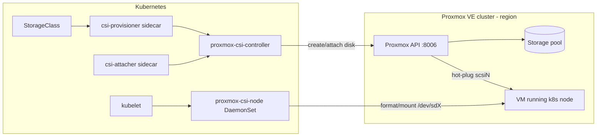

# Proxmox CSI Plugin — Technical Specifications

This document is an as-built technical specification of the Proxmox CSI Plugin: its components, CSI interface, volume model, configuration schema, and operational constraints, as implemented in this repository. Source file paths are cited throughout so every statement can be verified against the code.

This repository is a fork of [sergelogvinov/proxmox-csi-plugin](https://github.com/sergelogvinov/proxmox-csi-plugin). Fork-specific changes are called out where relevant (see [Configurable controller VMID](#controller-vmid)).

## 1. Overview

The Proxmox CSI Plugin is a [Container Storage Interface](https://github.com/container-storage-interface/spec) driver that provides Kubernetes persistent storage backed by Proxmox VE storage. Volumes are provisioned as Proxmox VM disks and hot-attached to the Proxmox VMs that run Kubernetes nodes as SCSI devices.

| Property | Value | Source |
|---|---|---|
| Driver name | `csi.proxmox.sinextra.dev` | `pkg/csi/driver.go` (`DriverName`) |
| Driver version constant | `0.7.0` | `pkg/csi/driver.go` (`DriverVersion`) |
| CSI spec version | `1.12.0` | `pkg/csi/driver.go` (`DriverSpecVersion`) |
| Application version | `v0.18.1-prod.1` | `charts/proxmox-csi-plugin/Chart.yaml` (`appVersion`) |
| Helm chart version | `0.5.9` | `charts/proxmox-csi-plugin/Chart.yaml` |
| Go module | `github.com/sergelogvinov/proxmox-csi-plugin` | `go.mod` |
| Go version | 1.26.3 | `go.mod` |
| License | Apache 2.0 | `LICENSE` |

> Note: the `DriverVersion` constant reported via `GetPluginInfo` lags the released application version (`appVersion`); they are versioned independently.

Key features:

- Dynamic volume provisioning on any Proxmox-supported storage (Directory, LVM, LVM-thin, ZFS, NFS, Ceph, …)
- Topology-aware scheduling across regions (Proxmox clusters) and zones (Proxmox nodes)
- Online volume expansion
- Volume snapshots and clones (experimental)
- LUKS-encrypted volumes
- Disk bandwidth/IOPS limits, runtime modification via VolumeAttributesClass
- ZFS volume replication across zones
- Offline volume migration between Proxmox nodes (`pvecsictl`)
- Multiple independent Proxmox clusters managed from one Kubernetes cluster

## 2. System Architecture

### 2.1 Components

The project builds three binaries from `cmd/`:

| Binary | Entry point | Deployed as | Role |
|---|---|---|---|
| `proxmox-csi-controller` | `cmd/controller/main.go` | Deployment (1 replica by default) | CSI Controller + Identity services; volume lifecycle against the Proxmox API |
| `proxmox-csi-node` | `cmd/node/main.go` | DaemonSet on every node | CSI Node + Identity services; device discovery, formatting, mounting, encryption |
| `pvecsictl` | `cmd/pvecsictl/main.go` | CLI tool (operator workstation), or in-cluster Deployment in `controller` mode | Volume migration, PV rename, PVC swap, migration controller, evacuation, rebalancing |



### 2.2 Topology model

| CSI concept | Proxmox concept | Kubernetes label |
|---|---|---|
| Region | Proxmox cluster (one API endpoint) | `topology.kubernetes.io/region` or `topology.proxmox.sinextra.dev/region` |
| Zone | Proxmox node | `topology.kubernetes.io/zone` or `topology.proxmox.sinextra.dev/node` |

The custom `topology.proxmox.sinextra.dev/*` labels (set by the Proxmox CCM) take precedence as alternatives to the standard labels (`pkg/csi/driver.go`, `ProxmoxRegion`/`ProxmoxNode` constants).

Volumes on node-local storage (LVM, ZFS, local directory) are pinned to one zone; volumes on shared storage (NFS, Ceph) are accessible from any zone in the region (see §5.2).

### 2.3 Sidecar containers

The controller pod bundles the standard CSI sidecars (versions from `charts/proxmox-csi-plugin/values.yaml`):

| Sidecar | Version | Purpose |
|---|---|---|
| csi-provisioner | v5.3.0 | Watches PVCs, calls `CreateVolume`/`DeleteVolume` |
| csi-attacher | v4.10.0 | Watches VolumeAttachments, calls `ControllerPublishVolume` |
| csi-resizer | v1.14.0 | Watches PVC size changes, calls `ControllerExpandVolume` |
| csi-snapshotter | v8.3.0 | Optional, disabled by default; snapshot lifecycle |
| livenessprobe | v2.16.0 | gRPC health checks |

The node pod runs `node-driver-registrar` (v2.15.0) alongside the node plugin.

## 3. Component Specifications

### 3.1 proxmox-csi-controller

Registers `ControllerServer` and `IdentityServer` on a gRPC endpoint (`cmd/controller/main.go`).

Command-line flags:

| Flag | Default | Description |
|---|---|---|
| `--csi-address` | `unix:///csi/csi.sock` | CSI gRPC endpoint |
| `--cloud-config` | (required) | Path to the Proxmox cloud config (§6) |
| `--kubeconfig` | in-cluster | Kubeconfig path for out-of-cluster runs |
| `--metrics-address` | disabled | TCP address for Prometheus metrics (e.g. `:8080`) |
| `--metrics-path` | `/metrics` | Metrics HTTP path |
| `--version` | | Print version and exit |

Plus standard `klog` flags (`-v` etc.).

Internal state (`pkg/csi/controller.go`, `ControllerService`):

- `pxpool` — pool of authenticated Proxmox API clients, one per region (`pkg/proxmoxpool/pool.go`)
- `vmID` — controller VMID used in disk naming (§5.3)
- `storageCapacity` — capacity cache, 1-minute TTL / 5-minute cleanup
- `vmLocks` — per-VM mutexes serializing attach/detach operations

### 3.2 proxmox-csi-node

Registers `NodeServer` and `IdentityServer` (`cmd/node/main.go`). At startup it resolves the node name, validates it, fetches the Node object, and fails fast if the region/zone topology labels are missing.

Command-line flags:

| Flag | Default | Description |
|---|---|---|
| `--csi-address` | `unix:///csi/csi.sock` | CSI gRPC endpoint |
| `--node-id` | `$NODE_NAME` env | Kubernetes node name (required via flag or env) |
| `--kubeconfig` | in-cluster (or `$KUBECONFIG`) | Kubeconfig path |
| `--master` | | Kubernetes API master URL (alternative to kubeconfig) |
| `--version` | | Print version and exit |

### 3.3 pvecsictl

Cobra-based CLI (`cmd/pvecsictl/main.go`) for operations the CSI interface does not cover. Subcommands:

| Command | File | Function |
|---|---|---|
| `migrate` | `cmd/pvecsictl/migrate.go` | Move a PV's backing disk between Proxmox nodes (offline migration) |
| `rename` | `cmd/pvecsictl/rename.go` | Rename a PersistentVolume |
| `swap` | `cmd/pvecsictl/swap.go` | Swap the volumes of two PVCs |
| `controller` | `cmd/pvecsictl/controller.go` | Run the annotation-driven migration controller (§3.4) |
| `evacuate` | `cmd/pvecsictl/evacuate.go` | Evacuate all CSI volumes from a Proxmox node (stamps migration annotations or runs synchronously with `--now`) |
| `rebalance` | `cmd/pvecsictl/rebalance.go` | Plan capacity-driven migrations of idle volumes from overloaded zones (run from a CronJob) |

Global flags: `--config/-f` (Proxmox cloud config), `--kubeconfig/-k`, `--log-level` (`info`, `warn`, `error`, `debug`). See `docs/pvecsictl.md`.

### 3.4 Migration controller (`pvecsictl controller`)

An annotation-driven controller (`pkg/controller/migration/controller.go`) that automates volume migration. It watches PVCs for `csi.proxmox.sinextra.dev/migrate-node` annotations and Nodes for `csi.proxmox.sinextra.dev/evacuate` annotations, and executes migrations through the shared orchestration package `pkg/migrator` — strictly one at a time (a single workqueue worker), because force migrations cordon every CSI node.

Key properties (see `docs/migration-controller.md` for the full protocol):

- **Request annotations** (PVC): `…/migrate-node: <zone>`, `…/migrate-force: "true"`
- **Status annotations** (PVC): `…/migrate-phase` (`Pending|Draining|Moving|Rewiring|Completed|Failed`), `…/migrate-message`, `…/migrate-attempts`, `…/migrate-started-at`; Events are emitted on the PVC
- **Crash recovery**: `…/migrate-state` is stamped on the PV before the disk move; an interrupted migration resumes at the rewire step. Cordoned nodes are always uncordoned via deferred cleanup (`pkg/migrator/migrator.go`)
- **Node evacuation**: `…/evacuate: <zone|"auto">` on a Node expands into per-PVC requests; `auto` selects targets by free capacity (`pkg/migrator/placement.go`)
- **Volume follows pods** (opt-in, `--pod-follow`): when every pod mounting a PVC is scheduled in a different zone than the volume (e.g. after VM migration), the volume migrates there automatically. Target storage is matched by name; if the zone lacks it, the per-node `primary_storage` map in the cloud config selects the storage (`…/migrate-storage` annotation, cross-storage disk move)
- **Leader election** via a `pvecsictl-migrator` Lease; retries with exponential backoff up to `--max-attempts` (default 5), then terminal `Failed`
- Requires Proxmox **root@pam** credentials (same constraint as `pvecsictl migrate`); deployed by the Helm chart's `migrator.*` values as a separate Deployment with its own ServiceAccount/RBAC/Secret

## 4. CSI Interface Specification

### 4.1 Identity service (`pkg/csi/identity.go`)

| RPC | Behavior |
|---|---|
| `GetPluginInfo` | Returns `csi.proxmox.sinextra.dev` / `DriverVersion` |
| `GetPluginCapabilities` | Advertises capabilities below |
| `Probe` | Always healthy |

Advertised plugin capabilities:

- `Service.CONTROLLER_SERVICE`
- `Service.VOLUME_ACCESSIBILITY_CONSTRAINTS` (topology)
- `VolumeExpansion.ONLINE`

### 4.2 Controller service (`pkg/csi/controller.go`)

Advertised controller capabilities (`controllerCaps`):

| Capability | Implementing RPC(s) |
|---|---|
| `CREATE_DELETE_VOLUME` | `CreateVolume`, `DeleteVolume` |
| `PUBLISH_UNPUBLISH_VOLUME` | `ControllerPublishVolume`, `ControllerUnpublishVolume` |
| `GET_CAPACITY` | `GetCapacity` (per-topology storage pool capacity, cached 1 min) |
| `CREATE_DELETE_SNAPSHOT` | `CreateSnapshot`, `DeleteSnapshot`, `ListSnapshots` |
| `CLONE_VOLUME` | `CreateVolume` with volume/snapshot content source |
| `EXPAND_VOLUME` | `ControllerExpandVolume` (online) |
| `GET_VOLUME` | `ControllerGetVolume` |
| `SINGLE_NODE_MULTI_WRITER` | access-mode support |
| `MODIFY_VOLUME` | `ControllerModifyVolume` (VolumeAttributesClass) |

Volume attachment: disks are hot-plugged into the target VM as SCSI devices (`deviceNamePrefix = "scsi"`), requiring the VirtIO SCSI controller on the VM.

### 4.3 Node service (`pkg/csi/node.go`)

Advertised node capabilities (`nodeCaps`):

- `STAGE_UNSTAGE_VOLUME` — `NodeStageVolume` locates the attached device by SCSI WWN, optionally opens a LUKS2 mapping (§7.2), formats (ext4 default, or xfs), and mounts to the staging path; `NodeUnstageVolume` reverses this
- `EXPAND_VOLUME` — `NodeExpandVolume` grows the filesystem after a controller-side resize
- `GET_VOLUME_STATS` — `NodeGetVolumeStats` reports bytes/inodes used/available

`NodePublishVolume` bind-mounts from the staging path (filesystem volumes) or exposes the raw block device (block volumes).

`NodeGetInfo` returns the node's accessible topology (region/zone segments) and the maximum attachable volume count (§11).

Supported access modes (`volumeCaps`):

- `SINGLE_NODE_WRITER`
- `SINGLE_NODE_READER_ONLY`
- `SINGLE_NODE_SINGLE_WRITER`
- `SINGLE_NODE_MULTI_WRITER`

Multi-node access modes (`ReadWriteMany` across nodes) are **not** supported — a Proxmox disk can be attached to only one VM at a time.

Supported filesystems: `ext4` (default) and `xfs` (`pkg/csi/driver.go`, `FSTypeExt4`/`FSTypeXfs`).

## 5. Volume Specification

### 5.1 Volume ID format

Defined in `pkg/utils/volume/volume.go`:

```
<region>/<zone>/<storage>/<diskName>
```

Example: `cluster-1/pve-node-2/local-zfs/vm-9999-pvc-0a1b2c3d.raw`

- `region` — Proxmox cluster name from the cloud config
- `zone` — Proxmox node name
- `storage` — Proxmox storage pool ID
- `diskName` — Proxmox disk name; the Proxmox volume ID is `<storage>:<diskName>` (`VolID()`)

### 5.2 Shared volumes

For shared storage (NFS, Ceph), the zone segment is empty (`VolumeSharedID()`):

```
<region>//<storage>/<diskName>
```

A shared volume can be published to any node in the region; zonal volumes can only be published in their zone.

### 5.3 Disk naming and VMID <a name="controller-vmid"></a>

Disk names follow the Proxmox convention:

```
vm-<VMID>-<pv-name>[.<format>]
```

The VMID is extracted with the regex `(^|-|/)vm-([1-9][0-9]{2,8})(-|$)` (`pkg/utils/volume/volume.go`, `vmidre`).

**Fork-specific feature — configurable controller VMID** (`pkg/config/config.go`): unattached volumes are owned by a placeholder VMID set by `features.controllerVmID`:

| Constant | Value |
|---|---|
| `DefaultControllerVMID` | `9999` |
| `MinControllerVMID` | `100` (configured value must be **greater than** 100) |

Configuring distinct controller VMIDs per Kubernetes cluster isolates each cluster's disks when multiple clusters share one Proxmox storage pool.

### 5.4 Size constraints (`pkg/csi/driver.go`)

| Constant | Value |
|---|---|
| `DefaultVolumeSizeBytes` | 10 GiB (when the PVC requests no size) |
| `MinChunkSizeBytes` | 512 MiB (minimum allocation granularity) |

## 6. Configuration Specification

The controller (and `pvecsictl`) read a YAML cloud config (`pkg/config/config.go`, parsed by `ReadCloudConfig`). Documented in `docs/config.md`.

```yaml
features:
  # Provider type: "default" (uses node providerID) or "capmox"
  # (cluster-api-provider-proxmox). Default: "default".
  provider: default
  # VM ID owning unattached volumes. Default: 9999. Must be > 100.
  controllerVmID: 9999

clusters:
  # One entry per Proxmox cluster (= region). Multiple clusters supported.
  - url: https://cluster-api-1.example.com:8006/api2/json
    insecure: false                     # skip TLS verification
    region: cluster-1                   # must match the node region labels

    # Authentication — exactly ONE of the following three methods:
    token_id: "kubernetes-csi@pve!csi"  # 1) inline API token
    token_secret: "..."
    # token_id_file: /etc/proxmox/token_id        # 2) token from files
    # token_secret_file: /etc/proxmox/token_secret
    # username: root@pam                          # 3) username/password
    # password: "..."
```

Validation rules (`ReadCloudConfig`):

- Each cluster must set `region` and an `http(s)` `url`
- Exactly one auth method per cluster (inline token, token files, or username/password); mixing methods is rejected
- `controllerVmID` defaults to 9999 and must be greater than 100

The config is mounted into the controller pod from a Secret at `/etc/proxmox/config.yaml` (chart value `configFile`).

Environment variables:

| Variable | Component | Purpose |
|---|---|---|
| `NODE_NAME` | node plugin | Node name when `--node-id` is not given |
| `KUBECONFIG` | node plugin | Kubeconfig path override |

## 7. StorageClass Parameters

Parsed in `pkg/csi/parameters.go` (`ExtractParameters`); documented in `docs/options.md`.

| Parameter | Type | Default | Description |
|---|---|---|---|
| `storage` | string | (required) | Proxmox storage pool ID |
| `storageFormat` | string | storage-dependent | `raw` or `qcow2` (file-based storage only) |
| `cache` | string | none | Disk cache mode: `directsync`, `none`, `writeback`, `writethrough` |
| `ssd` | bool | `false` | SSD emulation; also enables `discard=on` |
| `aio` | string | | Async I/O mode |
| `backup` | bool | `false` | Include disk in Proxmox backup jobs |
| `iothread` | bool | `true` | Dedicated I/O thread |
| `diskIOPS` | int | unlimited | Max read and write IOPS (applied to both `iops_rd`/`iops_wr`) |
| `diskMBps` | int | unlimited | Max read and write throughput in MB/s (`mbps_rd`/`mbps_wr`) |
| `blockSize` | int | mkfs default | Filesystem block size (bytes) |
| `inodeSize` | int | mkfs default | Filesystem inode size (bytes) |
| `replicate` | bool | `false` | Enable ZFS replication across zones |
| `replicateSchedule` | string | `*/15` | Replication schedule (systemd calendar format) |
| `replicateZones` | string | | Comma-separated zone names (max 2 zones) |

Standard Kubernetes parameters also apply: `csi.storage.k8s.io/fstype` (`ext4`/`xfs`), `allowVolumeExpansion`, `volumeBindingMode` (`WaitForFirstConsumer` recommended for zonal storage; configurable per storage class in the Helm chart), and `allowedTopologies`.

### 7.1 Mutable parameters (VolumeAttributesClass)

`ControllerModifyVolume` accepts (`ModifyVolumeParameters`, `pkg/csi/parameters.go`):

- `backup`
- `diskIOPS`
- `diskMBps`
- `replicateSchedule`

### 7.2 Encrypted volumes (LUKS)

Setting `csi.storage.k8s.io/node-stage-secret-name` / `...-namespace` on a StorageClass enables transparent LUKS2 encryption at stage time (`pkg/csi/node.go`, via `github.com/siderolabs/go-blockdevice`). The referenced Secret must contain the key `encryption-passphrase` (`pkg/csi/driver.go`, `EncryptionPassphraseKey`).

## 8. Kubernetes Node Requirements

Documented in `docs/options-node.md`; enforced at node-plugin startup and in the controller.

1. **Topology labels** (required):
   - `topology.kubernetes.io/region` — Proxmox cluster name (must match a `region` in the cloud config)
   - `topology.kubernetes.io/zone` — Proxmox node name
   - or the CCM equivalents `topology.proxmox.sinextra.dev/region` / `topology.proxmox.sinextra.dev/node`
2. **Provider ID** (default provider): `Node.spec.providerID` in the form `proxmox://<region>/<vmid>`, used to find the VM for disk attachment. With `provider: capmox`, the VMID is resolved through cluster-api-provider-proxmox conventions instead.
3. **VM SCSI controller**: VMs must use `VirtIO SCSI single` (recommended) or `VirtIO SCSI`.
4. **Optional per-node attachment limit**: label `csi.proxmox.sinextra.dev/max-volume-attachments` overrides the default of 24 (`pkg/csi/driver.go`, `NodeLabelMaxVolumeAttachments`).

## 9. Security & Permissions

### 9.1 Proxmox API privileges (`docs/install.md`)

Base CSI role:

```
VM.Audit VM.Config.Disk Datastore.Allocate Datastore.AllocateSpace Datastore.Audit
```

Extended role (required for ZFS replication / migration features):

```
VM.Audit VM.Allocate VM.Clone VM.Config.CPU VM.Config.Disk VM.Config.HWType
VM.Config.Memory VM.Config.Options VM.Migrate VM.PowerMgmt
Datastore.Allocate Datastore.AllocateSpace Datastore.Audit
```

Conventional setup: user `kubernetes-csi@pve` with token `kubernetes-csi@pve!csi`, created with privilege separation disabled (`privsep=0`). Volume snapshots currently require `root@pam` (see `docs/volumesnapshot.md` — experimental).

### 9.2 Kubernetes RBAC (chart templates)

Controller ClusterRole (`charts/proxmox-csi-plugin/templates/controller-clusterrole.yaml`): persistentvolumes (get/list/watch/create/patch/delete), persistentvolumeclaims (+status patch), storageclasses, csinodes, nodes, volumeattachments (+status patch), volumeattributesclasses, events; snapshot CRDs when the snapshotter is enabled.

Node ClusterRole (`templates/node-clusterrole.yaml`): nodes (get) only.

### 9.3 Container security

From `charts/proxmox-csi-plugin/values.yaml` and the `Dockerfile`:

- Controller: distroless static image, `runAsNonRoot: true`, UID/GID 65532, all capabilities dropped, `RuntimeDefault` seccomp
- Node plugin: distroless base image plus mount/filesystem tools (e2fsprogs, xfsprogs, cryptsetup); requires privileged mode for mount operations (namespace uses the `privileged` Pod Security level)
- Images are signed with Cosign (`docs/cosign.md`); scanned with Trivy in CI

## 10. Deployment

| Method | Location |
|---|---|
| Helm chart | `charts/proxmox-csi-plugin/` (OCI: `ghcr.io/crunchymonkies/charts/proxmox-csi-plugin` (fork)) |
| Raw manifests | `docs/deploy/proxmox-csi-plugin.yml` (edge), `-release.yml`, `-talos.yml` |
| Talos-specific values | `charts/proxmox-csi-plugin/values.talos.yaml` |
| Examples | `docs/deploy/test-*.yaml`, `docs/deploy/pvc.yaml` |

Container images (fork registry `ghcr.io/crunchymonkies`): `proxmox-csi-controller`, `proxmox-csi-node`, `pvecsictl`. Architectures: `linux/amd64`, `linux/arm64`.

Supported distributions (kubelet dir overrides in `values.yaml`): vanilla Kubernetes (`/var/lib/kubelet`), Talos, k0s (`/var/lib/k0s/kubelet`), microk8s (`/var/snap/microk8s/common/var/lib/kubelet`).

Default namespace: `csi-proxmox`, priority class `system-cluster-critical`.

## 11. Operational Characteristics & Limits

| Limit / behavior | Value | Source |
|---|---|---|
| Default max volumes per node | 24 | `pkg/csi/driver.go` (`DefaultMaxVolumesPerNode`) |
| Hard max volumes per node | 30 (QEMU SCSI device limit) | `pkg/csi/node.go` (`VolumesPerNodeHardLimit`) |
| Default volume size | 10 GiB | `pkg/csi/driver.go` |
| Minimum allocation chunk | 512 MiB | `pkg/csi/driver.go` |
| Storage capacity cache TTL | 1 minute | `pkg/csi/controller.go` (`cache.New(time.Minute, …)`) |
| Replication zones per volume | max 2 | `docs/options.md` |
| ReadWriteMany across nodes | not supported | §4.3 |
| Snapshot support | experimental, needs `root@pam` | `docs/volumesnapshot.md` |
| Local-storage volume migration | manual, via `pvecsictl migrate` | `docs/pvecsictl.md` |

Metrics: when `--metrics-address` is set, the controller exposes Prometheus metrics (Proxmox API request counts/latency) at `--metrics-path` (default `/metrics`). See `docs/metrics.md`.

Storage capacity tracking: with the chart option `options.enableCapacity` (default `true`), the provisioner publishes `CSIStorageCapacity` objects so the scheduler avoids zones whose pools lack space.

## 12. Build & Test

### 12.1 Build (`Makefile`)

| Target | Action |
|---|---|
| `make build` | Build all three binaries to `bin/` |
| `make build-all-archs` | Build for amd64 + arm64 |
| `make lint` | golangci-lint |
| `make unit` | Unit tests (`go test -tags=unit ./...`) |
| `make test` | lint + unit |
| `make helm-unit` | Helm lint + template validation |
| `make images` | Multi-arch container images (Docker buildx) |
| `make docs` | Regenerate chart README from values |

The `Dockerfile` is multi-stage: builder (golang:1.26.3-alpine) → `proxmox-csi-controller` (distroless/static-debian13), `proxmox-csi-node` (distroless/base-debian13 + mount/crypto tools), `pvecsictl` (alpine:3.23).

### 12.2 CI (`.github/workflows/`)

- `build-test.yaml` — PR lint, unit tests, multi-arch build
- `build-edge.yaml` — edge images on push to main
- `release.yaml` — tagged releases: images, Cosign signing, GoReleaser (CLI binaries + Homebrew)
- `release-please.yml` / `release-charts.yaml` — automated release PRs and chart publishing
- `conform.yaml` — conventional-commit conformance

### 12.3 Tests

- Unit tests: `pkg/**/*_test.go` (csi, config, proxmoxpool, utils packages), helpers in `test/`
- Manual e2e scenarios: `hack/e2e-tests.md` (encrypted PVs, snapshots, expansion)

## 13. References

| Document | Content |
|---|---|
| `README.md` | Feature overview, quick start |
| `docs/install.md` | Full installation guide (Proxmox + Kubernetes + Helm/Talos) |
| `docs/config.md` | Cloud config reference |
| `docs/options.md` | StorageClass parameter reference |
| `docs/options-node.md` | Node labels, providerID, SMBIOS settings |
| `docs/architecture.md` | Pod/volume migration architecture diagrams |
| `docs/volumesnapshot.md` | Snapshot usage (experimental) |
| `docs/pvecsictl.md` | CLI tool usage and RBAC |
| `docs/migration-controller.md` | Migration controller operator guide: usage, limitations, design rationale, Proxmox version caveats |
| `docs/metrics.md` | Prometheus metrics reference |
| `docs/faq.md` | Common questions |
| `docs/benchmark.md` | Performance benchmarks |
| `CHANGELOG.md` | Release history |
